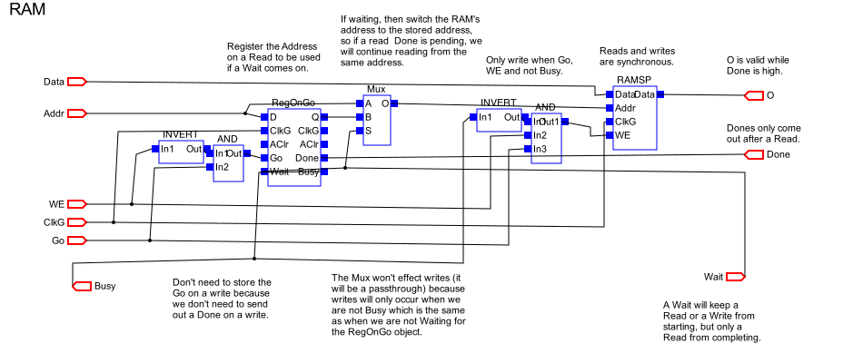
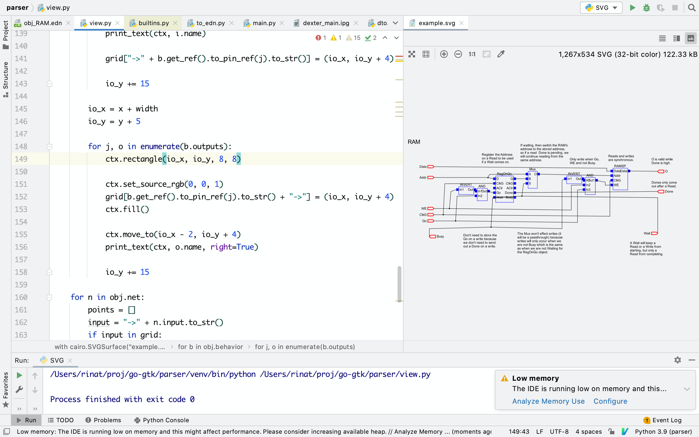
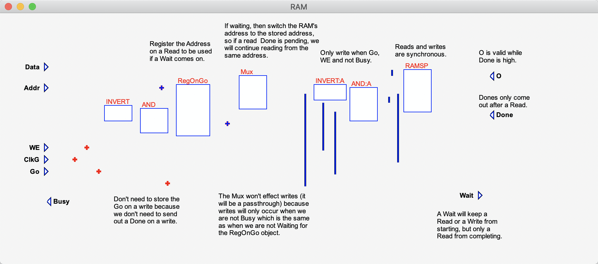
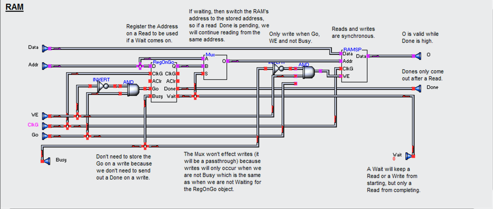

# viva-tools

This is a collection of tools to work with the files produced by Viva IDEs -
heterogeneous architecture compiler tools capable of targeting FPGAs.

This is a work in progress and is likely to stay this way for the years to
come. The goal here is to learn more about the hardware through the unique perspective that Viva/Azido tooling provides. Ultimately, to get back to the hobby project of building a robotic hand.

*Read the story below for the updates.*


# The story

In year 2019 I got inspired with the robotic hand design (published and open
sourced by the Haddington Dynamics). There was some exploration and blog posts:

- [Picking a robotic hobby (2019)](https://abdullin.com/child-friendly-hobby/)
- [Dive into FPGA, PCB and 3D printing
  (2019)](https://abdullin.com/dive-into-fpga/)
- [Robotic R&D: FPGA and ML Pipelines
  (2019)](https://abdullin.com/running-on-a-real-fpga/)

At some point the project got put on hold. The biggest roadblock was the
difficulty of getting proficient with the FPGA programming. Proficient enough
to implement the FPGA-driven loop between the optical encoders and the motors.

Fast-forward some time later and I'm back at the project again. However, this
time trying a different approach: learn enough about the Viva tool used to
program Dexter FPGA. It has a unique approach that is different from the
Verilog/VHDL.

The Viva tool itself was published at some point by [Haddington Dynamics](https://github.com/HaddingtonDynamics/Dexter) as a
binary, along with a source code for the Dexter gateware. Plus, the partial
source code of Viva was made available at some point under the GPL-3.0 license
(all included in this repository).

That information might be enough to find a way to:

- read CoreLib and Dexter files;
- display and manipulate them in a GUI;
- perform recursive resolution of the files;
- synthesize the solutions for x86/ARM (to simulate) and for the Zynq/Xilinx
  boards (to execute).

Even if I fail (and I probably will), the journey is already worth the lessons
learnt.

# Updates

## December 11 2020



Switched from C# to pure Python for figuring out the rendering rules. Cairo+Pango are good enough and result in feedback cycle of less than a second (between hitting a shortcut and seeing an updated image).

This also had an added benefit, that I could update the domain model directly in Python, while still keeping it connected to the actual data.

Next steps:

- try to cleanup the transport lines (so that they match more-or-less renders from Viva)
- look into performing a basic recursive expansion.

An annoying side-effect is that PyCharm has a memory leak that is probably caused by continuous reloading of the same SVG.




## December 06 2020



Python parser works out good enough. I also introduced intemediate DTO objects that allow to experiment with different output formats.

Currently using EDN as a sort of test suite to prevent regressions as a tweak regex expressions. I didn't bother with writing a proper lexer/parser at this point, since that would just derail from the main objective: understand the domain and start gravitating towards a specific stack.

Although EDN is nice and compact, reading it from the statically typed
languages is a pain. So I added JSON output format to actually persist Viva
designs for loading in C# (.NET Core). It looks really ugly but is good enough.

This allows to start iterating on the best tech stack for loading and manipulating these designs (the ultimate goal is to learn). The process is highly subjective, which is OK at this point, since there is no team to worry about.

Failed attepmts that didn't quite work out:

- C++ + Borland/Embarcadero - I'm not fluent in C++, this hampers the progress. Pass.
- Lazarus (Pascal + Delphi IDEs) - UI experience is a breath of fresh air (and a blast from the familiar past). Pascal doesn't feel like a productive environment to me anymore, though. Pass.
- Clojure + Spring - Clojure is nice, fits EDN. Drawing with it in Spring
  requires figuring out threading in Clojure. Pass for now (despite the Lisp appeal for manipulating the data structures).
- Qt + Python - Qt is C++, so bindings are messy in every single language. Plus
  it feels heavy to install and use. Pass for now.
- Go + GTK - I love go, but it just gets too verbose in complex projects. Let's
  leave it to Hashicorp and K8S guys. Pass for now.
  
In the end, I managed to make the most progress with C# (.NET Core) and GTK: load the designs and and start displaying them.

This works good enough to establish an initial feedback loop:

- try to load an interesting file;
- hit an error (usually NRE);
- save the file into the `cases` folder for the parser;
- figure out the desired output in EDN format, save it to the `cases`;
- make sure all scenarios pass;
- re-generate the JSON output and load it in C#.

The next objective is to try to draw these missing connection lines. Ultimately I should have something that looks like the image below:




## November 29 2020

Making first tangible steps with parsing Viva text files. They are well documented in the readme, but still have an occasional nuance or two. I'd personally prefer to store the data in a format that is still human-readable (for git diffs) but has an established ecosystem for parsing. Current candidates EDN and JSON (YAML over my dead body).

Once the text is parsed via Python into something slightly more convenient, I could quickly iterate on tech/language stacks for displaying and manipulating the designs.

Here is an example of such conversion:

```
Object ( List WholeLSB, List Out2) StripWholeLSB( List In1)
//_ Attributes TreeGroup="BotControl"
{
 //_ Object Prototypes
 Object ( List In1) Input;  //_GUI 24,32
 Object Output( List WholeLSB) ;  //_GUI 88,31
 Object Output:A( List Out2) ;  //_GUI 88,40
 Object ( Variant Out1, Variant Out2) ListIn( List In) ;  //_GUI 29,30
 Object ( List Out) ListOut( Variant In1, Variant In2) ;  //_GUI 73,38
 Object ( List Out) ListOut:A( Variant In1, Variant In2) ;  //_GUI 74,29
 Object ( Variant WholeLSB, Variant Out2) StripWholeLSB( Variant In1) ;  //_GUI 47,38
 Object ( Variant WholeLSB, Variant Out2) StripWholeLSB:A( Variant In1) ;  //_GUI 47,29

 //_ Behavior Topology
 Output.0 = ListOut:A.0;
 Output:A.0 = ListOut.0;
 ListIn.0 = Input.0;
 ListOut.0 = StripWholeLSB.1;
 ListOut.1 = StripWholeLSB:A.1;  //_GUI 68,40, 68,34
 ListOut:A.0 = StripWholeLSB.0;  //_GUI 71,34, 71,37, 65,37, 65,40
 ListOut:A.1 = StripWholeLSB:A.0;
 StripWholeLSB.0 = ListIn.0;  //_GUI 40,41
 StripWholeLSB:A.0 = ListIn.1;
}
```

Resulting EDN that is easier to parse:

```edn
(:object
  (:proto "StripWholeLSB" [("List" "In1")] [("List" "WholeLSB") ("List" "Out2")] {:TreeGroup "BotControl"})
  [(:proto "Input" [] [("List" "In1")] {:gui (24 32)})
   (:proto "Output" [("List" "WholeLSB")] [] {:gui (88 31)})
   (:proto "Output:A" [("List" "Out2")] [] {:gui (88 40)})
   (:proto "ListIn" [("List" "In")] [("Variant" "Out1") ("Variant" "Out2")] {:gui (29 30)})
   (:proto "ListOut" [("Variant" "In1") ("Variant" "In2")] [("List" "Out")] {:gui (73 38)})
   (:proto "ListOut:A" [("Variant" "In1") ("Variant" "In2")] [("List" "Out")] {:gui (74 29)})
   (:proto "StripWholeLSB" [("Variant" "In1")] [("Variant" "WholeLSB") ("Variant" "Out2")] {:gui (47 38)})
   (:proto "StripWholeLSB:A" [("Variant" "In1")] [("Variant" "WholeLSB") ("Variant" "Out2")] {:gui (47 29)})
   (:net "Output.0" "ListOut:A.0" {})
   (:net "Output:A.0" "ListOut.0" {})
   (:net "ListIn.0" "Input.0" {})
   (:net "ListOut.0" "StripWholeLSB.1" {})
   (:net "ListOut.1" "StripWholeLSB:A.1" {:gui [(68 40) (68 34)]})
   (:net "ListOut:A.0" "StripWholeLSB.0" {:gui [(71 34) (71 37) (65 37) (65 40)]})
   (:net "ListOut:A.1" "StripWholeLSB:A.0" {})
   (:net "StripWholeLSB.0" "ListIn.0" {:gui [(40 41)]})
   (:net "StripWholeLSB:A.0" "ListIn.1" {})])
```

# Folders

## Files

Files folder contains a collection of references, docs and files found on the Github
earlier. Of particular interest are: partial sources of Viva, Azido.msi and
Dexter Gateware.

## Parser

Parser - a Python utility to parse Viva text files and experiment with
converting it into different formats. The purpose is to explore the domain
and figure out the most convenient format (human-readable for git diffing,
yet convenient to read/write from the software). 

Currently using EDN and JSON. EDN displays nicely but is pain to read from the
.NET C#. JSON is ugly to read but easier to deserialize.

## Viewer

Viewer is an experiment in loading Viva/Azido files and displaying them. The
purpose is to find a set of technologies that fit the constraints and are the
most comfortable for me to iterate rapidly upon. It is an extremely subjective thing.

Current version does this with C# and GTK.
